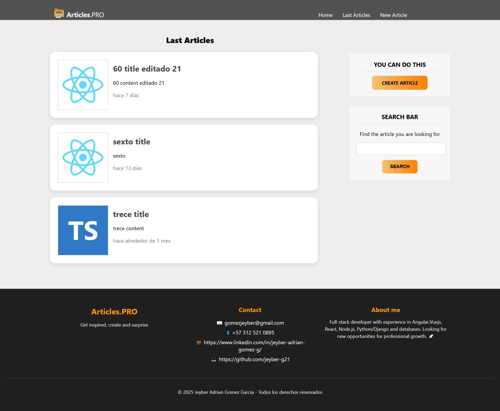
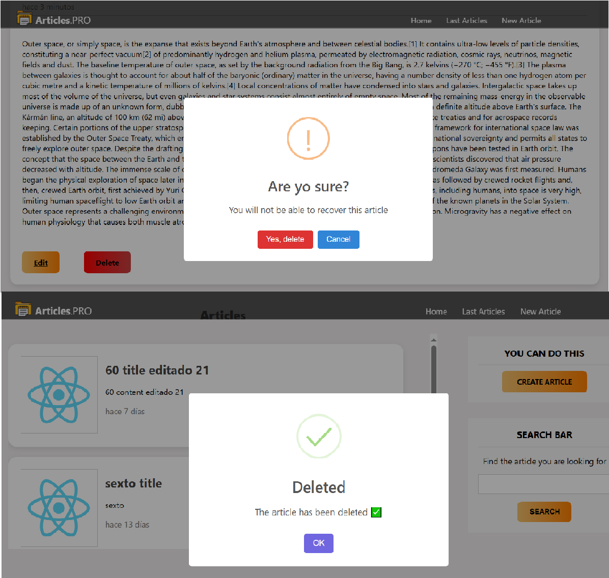

# React + TypeScript + Vite

This template provides a minimal setup to get React working in Vite with HMR and some ESLint rules.

Currently, two official plugins are available:

- [@vitejs/plugin-react](https://github.com/vitejs/vite-plugin-react/blob/main/packages/plugin-react) uses [Babel](https://babeljs.io/) for Fast Refresh
- [@vitejs/plugin-react-swc](https://github.com/vitejs/vite-plugin-react/blob/main/packages/plugin-react-swc) uses [SWC](https://swc.rs/) for Fast Refresh

## Expanding the ESLint configuration

If you are developing a production application, we recommend updating the configuration to enable type-aware lint rules:

```js
export default tseslint.config([
  globalIgnores(["dist"]),
  {
    files: ["**/*.{ts,tsx}"],
    extends: [
      // Other configs...

      // Remove tseslint.configs.recommended and replace with this
      ...tseslint.configs.recommendedTypeChecked,
      // Alternatively, use this for stricter rules
      ...tseslint.configs.strictTypeChecked,
      // Optionally, add this for stylistic rules
      ...tseslint.configs.stylisticTypeChecked,

      // Other configs...
    ],
    languageOptions: {
      parserOptions: {
        project: ["./tsconfig.node.json", "./tsconfig.app.json"],
        tsconfigRootDir: import.meta.dirname,
      },
      // other options...
    },
  },
]);
```

You can also install [eslint-plugin-react-x](https://github.com/Rel1cx/eslint-react/tree/main/packages/plugins/eslint-plugin-react-x) and [eslint-plugin-react-dom](https://github.com/Rel1cx/eslint-react/tree/main/packages/plugins/eslint-plugin-react-dom) for React-specific lint rules:

```js
// eslint.config.js
import reactX from "eslint-plugin-react-x";
import reactDom from "eslint-plugin-react-dom";

export default tseslint.config([
  globalIgnores(["dist"]),
  {
    files: ["**/*.{ts,tsx}"],
    extends: [
      // Other configs...
      // Enable lint rules for React
      reactX.configs["recommended-typescript"],
      // Enable lint rules for React DOM
      reactDom.configs.recommended,
    ],
    languageOptions: {
      parserOptions: {
        project: ["./tsconfig.node.json", "./tsconfig.app.json"],
        tsconfigRootDir: import.meta.dirname,
      },
      // other options...
    },
  },
]);
```

# Articles.PRO Description

Articles.PRO offers a clean and modern interface designed to inspire creativity and engagement.

## video demonstration and explanation

## 🚀 useful links

🔗 [Demo en vivo](https://youtu.be/W51AyaRcj48)  
📦 [Repository Backend](https://github.com/jeyber-g21/Backend)

## Home Page

;

Navigation is intuitive, featuring a fixed top bar with accessible links to Home, Last Articles, and New Article. The combination of professional aesthetics and user-friendly structure creates an ideal environment for exploring and creating content.

This design demonstrates proficiency in React + TypeScript, as well as an understanding of UI/UX principles, layout composition, and responsive web design.

## Last Articles Page

;

The Last Articles page displays the most recently created posts in a clean, card-based layout that emphasizes readability and organization. Each article is presented inside a rounded white card with soft shadows, ensuring clear separation and a modern aesthetic consistent with the site’s overall design.

The visual hierarchy is well structured: article titles appear in bold, followed by brief descriptions and timestamps that indicate publication recency. On the right panel, the user is encouraged to interact through two essential features — a “Create Article” button styled with a vibrant orange gradient for clear visual emphasis, and a search bar that allows filtering articles efficiently.

The footer integrates personal and professional contact details in a well-aligned layout, including email, LinkedIn, GitHub, and a short bio — giving the page a polished, portfolio-ready appearance.

## New Article (Create Article) Page

;

The Create Article page offers a minimalist and intuitive interface designed to encourage users to express their creativity easily. The layout centers a clean, rounded form card with subtle shadows, achieving an elegant and modern look that aligns with the platform’s aesthetic identity.

The form includes input fields for title, content, and image upload, ensuring that users can create rich, personalized articles. The file input button stands out in a warm orange gradient, maintaining color consistency with the site’s call-to-action elements. The Save button follows the same visual language, reinforcing interaction clarity and design harmony.

This section highlights technical skills in React + TypeScript, form handling, and file upload integration, as well as a solid grasp of UI design principles, component reusability, and responsive layout structuring.

## Article Details Page

;

The Article Detail page delivers a clean and immersive reading experience where each article is presented with visual balance and focus. The layout follows a centered, single-column design that highlights both the featured image and the article content, ensuring optimal readability and aesthetic appeal.

A high-resolution cover image spans the top section, creating an immediate visual impact and contextual introduction to the article. Below, the title and publication time are displayed with clear typography, followed by the main content arranged in a spacious and well-formatted text block, making it pleasant to read even on large screens.

At the bottom of the article, Edit and Delete buttons are prominently placed, using a vibrant orange color palette that keeps interaction intuitive and consistent with the overall branding of the platform.

## Edit Article Page

;

The Edit Article page provides a refined and intuitive environment where users can update or enhance their published content.

The central form is presented within a rounded white card with soft shadows, delivering a modern, minimalist aesthetic. Users can easily edit the title, content, and featured image fields, supported by clear input areas that improve readability and focus.

Above the form, a motivational tagline encourages creativity and continuous improvement, reinforcing the platform’s purpose: to inspire users to refine and share their best work. The right sidebar provides quick navigation shortcuts for creating new articles and searching existing ones, ensuring smooth workflow transitions.

## Delete Article (Button) Page

;

The delete confirmation feature in Articles.PRO implements a modern and user-friendly SweetAlert2 modal system to ensure safe and intuitive interaction when removing content.

When a user attempts to delete an article, a custom alert dialog appears at the center of the screen, dimming the background to focus attention on the decision. The modal uses clear visual hierarchy and color contrast — a warning icon and a red “Yes, delete” button emphasize the potential impact of the action, while a secondary “Cancel” option provides a safe exit.

Upon confirmation, a success alert is displayed with a clean checkmark animation and a confirmation message: “The article has been deleted.” This sequence provides real-time feedback, enhancing the user experience with responsive and professional interaction design.

The integration demonstrates proficiency in React + TypeScript, SweetAlert2 customization, and UI feedback logic, ensuring a smooth, error-free workflow that balances functionality, aesthetics, and usability.

## Search Article (Search Bar) Page

;

The Search Results page in Articles.PRO dynamically displays articles that match the user’s search query. Designed with a clean and intuitive interface, it allows users to quickly discover content by title or keyword.

Each result is presented inside a responsive card layout featuring the article’s title, a brief description, and the publication date, providing a quick overview without overwhelming the user.

## To conclude

Articles.PRO represents a modern, user-centered web application that combines functionality, performance, and elegant design. Built with a component-based architecture in React and TypeScript, it demonstrates a clear understanding of scalability, modularity, and maintainability in front-end development.

From the homepage to the search results, every section was crafted following UX/UI best practices — emphasizing clarity, consistency, and accessibility. The interface guides the user naturally through each interaction, ensuring an intuitive experience with well-structured layouts, balanced typography, and contrasting accent colors that highlight key actions such as creating or searching for articles.

In summary, Articles.PRO is not just a technical project — it’s a reflection of thoughtful design and professional execution, merging aesthetic appeal with functional precision to deliver a delightful and productive user experience.
